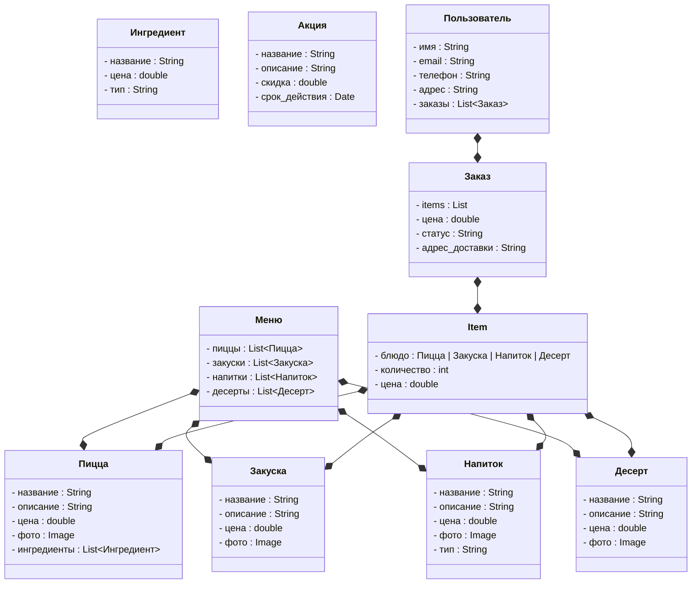
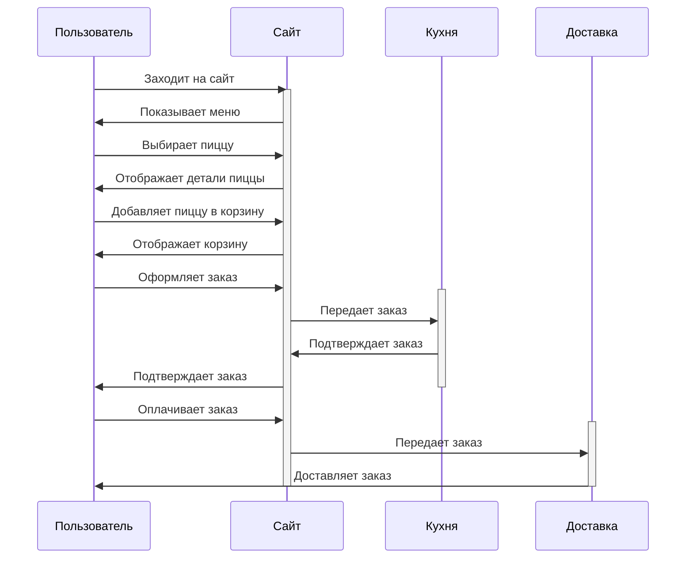
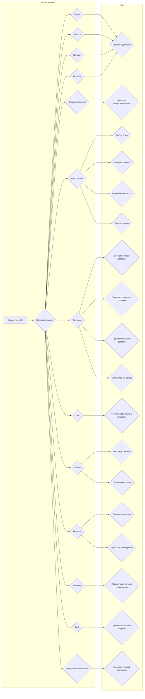

# Приложение "Кусок Италии"

### 1. Меню
- **Пиццы**
  - Описание и фотографии различных видов пиццы
- **Закуски**
  - Антипасти, салаты, гарниры
- **Напитки**
  - Безалкогольные и алкогольные напитки
- **Десерты**
  - Тирамису, канноли и другие сладости

### 2. Специальные предложения
- Акции и скидки
- Сезонные и ограниченные предложения
- Комбо-наборы

### 3. Заказ онлайн
- Выбор пиццы и других блюд
- Настройка заказа (выбор теста, добавление ингредиентов)
- Оформление и оплата заказа

### 4. Доставка
- Условия и стоимость доставки
- Время доставки
- Отслеживание заказа

### 5. О нас
- История пиццерии
- Философия и концепция
- Команда и шеф-повар

### 6. Отзывы
- Комментарии и оценки от клиентов
- Возможность оставить свой отзыв

### 7. Рецепты
- Подборка рецептов пиццы и итальянских блюд
- Видеоуроки и советы от шефа

### 8. Контакты
- Адрес и карта расположения
- Телефон и электронная почта
- Социальные сети

### 9. Часто задаваемые вопросы (FAQ)
- Ответы на распространенные вопросы
- Политика возврата и обмена

### 10. Программа лояльности
- Бонусы и скидки для постоянных клиентов
- Специальные условия для участников программы

### 1. Диаграмма классов

### 2.Диаграмма сценариев

### 3.Диаграмма активности

